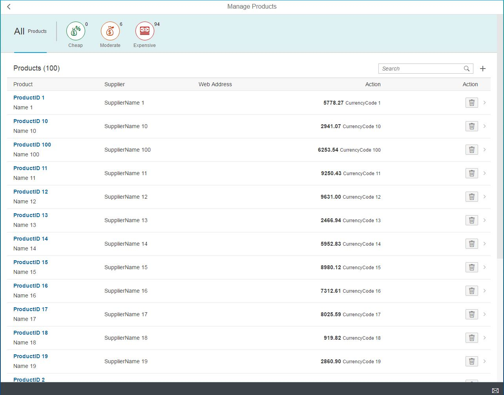

# opesapui5-myapp2
Training Managed ProductsApp from openSAP Course 2016 - Developing Web Apps with SAPUI5

Standalone runnable files (*.html) are located in the test-folder

This application is ready for client-side build in the SAP Web IDE and deployment to ABAP/HCP repositories